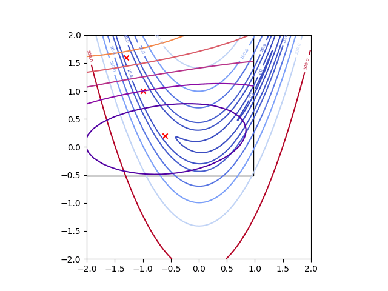
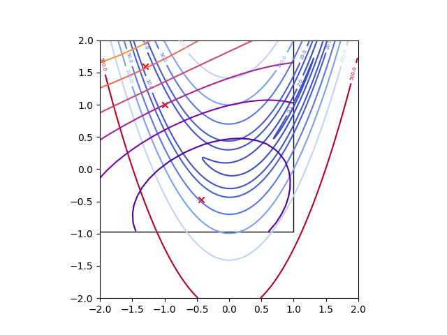

# LABCAT: Locally adaptive Bayesian optimization using principal component-aligned trust regions 

`labcat` is a Rust crate that implements the LABCAT algorithm as derived in the original [paper](https://doi.org/10.48550/arXiv.2311.11328). This algorithm extends the trust-region-based Bayesian optimization framework developed in algorithms such as TuRBO and BADS with the addition of weighted-principal-component-based rotation and local-length-scale-based rescaling of the trust region.

## Installation

The `labcat` Rust library can be added as a dependency using by adding the following to the `[dependencies]` section of the `Cargo.toml` file of the current Rust project:

```toml
[dependencies]
labcat = { version = "0.2.0", git = "https://github.com/esl_sun/labcat"}
```


To install the Python package, clone the repository, navigate to the `python` directory and install the [`maturin`](https://github.com/PyO3/maturin) package using:

```sh
git clone https://github.com/esl-sun/labcat
cd ./labcat/python
pip install maturin
```

To install the Python module into a virtual environment directly, use the command:

```sh
(venv) maturin develop --release
```

> [!NOTE]
>
> The `--release` flag is recommended when using this library to ensure that the Rust compiler can optimize for as much performance as possible.

or to build a Python wheel (that can installed using `pip install`), use the command:

```sh
maturin build --release
```

## Quick Start

Rust examples can be found in the [examples](https://github.com/termoshtt/ndarray-linalg/tree/master/ndarray-linalg/examples) directory and can be executed from a local clone of the repository using:

```sh
git clone https://github.com/esl-sun/labcat
cd ./labcat
cargo run --example bounds --release
cargo run --example demo --release
```

Python examples can be found in the `python/examples` directory and executed (assuming that the `labcat` Python module has been installed in the current environment using `maturin`) using:

```sh
python ./python/examples/bounds.py
python ./python/examples/demo.py
```

## Demo

To demonstrate the LABCAT algorithm, we first apply a standard form of trust-region-based Bayesian optimization to the Rosenbrock function, a function with a banana-shaped valley sloping towards the minimum at $(1.0, 1.0)$. This form of Bayesian optimization uses a trust region to both limit the area being approximated by the Gaussian process surrogate model and limit where the next point should be sampled, allowing for generally improved efficiency when compared to the global form of standard Bayesian optimization. However, when applied to the Rosenbrock funtion, the curved valley forces the trust region to become very small, slowing progress towards the minimum significantly.

 

The LABCAT algorithm extends this approach by allowing the trust region to rotate itself, aligning with the local geometry of the function (inferred using the weighted principal components of the observed data). By aligning the trust region with the valley of the Rosenbrock function, the trust region can expand itself along the valley and make much faster progress to the minimum.



> [!NOTE]
>
> LABCAT is not a *global* optimization algorithm (such as standard Bayesian optimization), rather being a robust *local* optimization algorithm. This means that the algorithm can still get stuck and better results can be obtained with multiple runs of the algorithm. Also note that LABCAT is a *minimization* algorithm and, therefore, potential maximization problems must be reformulated beforehand.

## Compatibility

Minimum supported Rust version: 1.85.0

Minimum supported Python version: 3.7.0

By default, the `ndarray-linalg` crate used by the Rust examples and Python bindings will statically link to the [`openblas`](https://github.com/blas-lapack-rs/openblas-src) (Unix-based systems) or [`intel-mkl`](https://github.com/rust-math/rust-intel-mkl) LAPACK crates. To enable dynamic linking to pre-installed versions of these libraries (shrinking the size of the compiled executable and target folder), please refer to the [documentation](https://github.com/rust-ndarray/ndarray-linalg) of the `ndarray-linalg` crate to enable the correct features of this crate. 